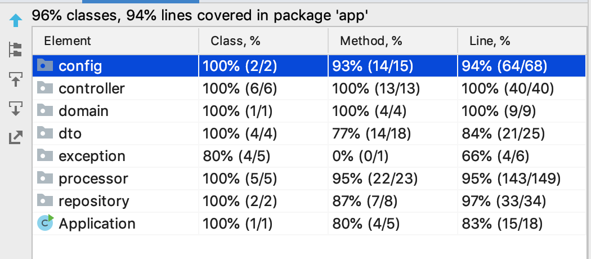

### Run with docker:
```
docker build -f docker/Dockerfile.builder -t builder .
docker build -t rev-rest:1.0 -f docker/Dockerfile .
docker run -d -p 8088:8088 rev-rest:1.0
```
Then application should be available on this host:
http://localhost:8088


## Available endpoints
    GET /info 
    GET /healtcheck
    PUT /api/v1/transfer
    
### PUT /api/v1/transfer
#### Request structure
    {
        "sourceAccount": "UUID0",
        "destAccount": "UUID1",
        "amount": 21.02, //decimal
        "transferIdentifier": "UUID"
    }
**transferIdentifier** - is a unique identifier of a new 
transfer generated on a client side. 
By this sending same PUT request several times
 won't result to a multiply new transfers.
 
#### Response structure
    {
        "uuid":"transferUUID"
    }
#### Response status = **202 Accepted**

## Coverage
  